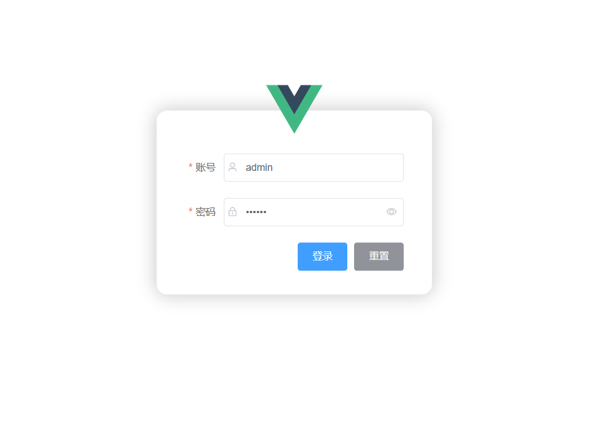
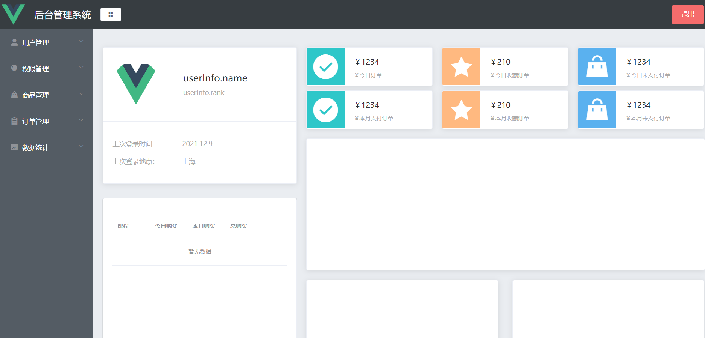
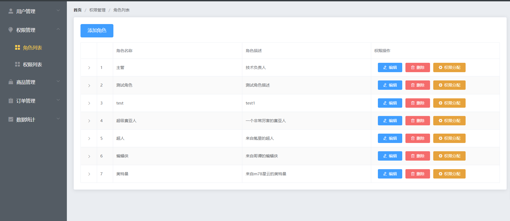
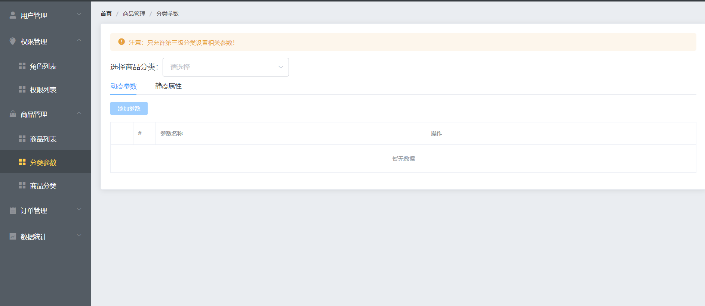

<<<<<<< HEAD
#项目说明：
    一个pc端的后台管理系统
    ##技术栈：
        vue2、ElementUI、vue-router、vuex、axios、lodash、echarts、vue-quill-editor(富文本编辑器）
    ##功能实现：
        *登录功能
        *登录校验（token）
        *侧边栏封装组件
        *面包屑
        *vuex，store组件传值
    ##打包优化：
        *组件按需导入
        *通过extarnals加载外部cdn
        *实现路由懒加载
    ##展示图:
    
    
    
    
=======
项目说明：
    技术栈：
        vue2、ElementUI、vue-router、vuex、axios、lodash、echarts、vue-quill-editor(富文本编辑器）
    功能实现：
        ·登录功能
        ·登录校验（token）
        ·侧边栏封装组件
        ·面包屑
        ·vuex，store组件传值
    打包优化：
        ·组件按需导入
        ·通过extarnals加载外部cdn
        ·实现路由懒加载
>>>>>>> 9c754f3ce6438a366a0f0bcb861ef4fb493506db
